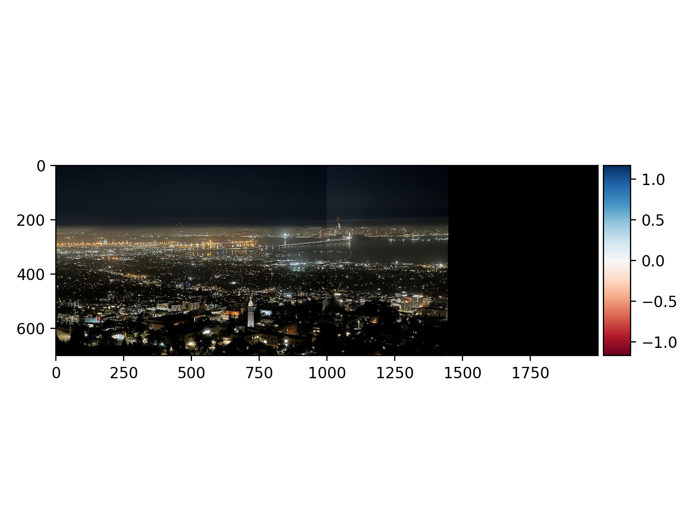
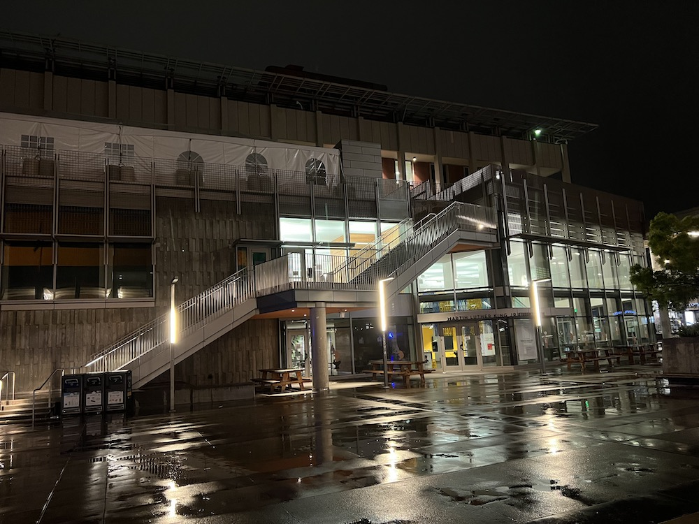
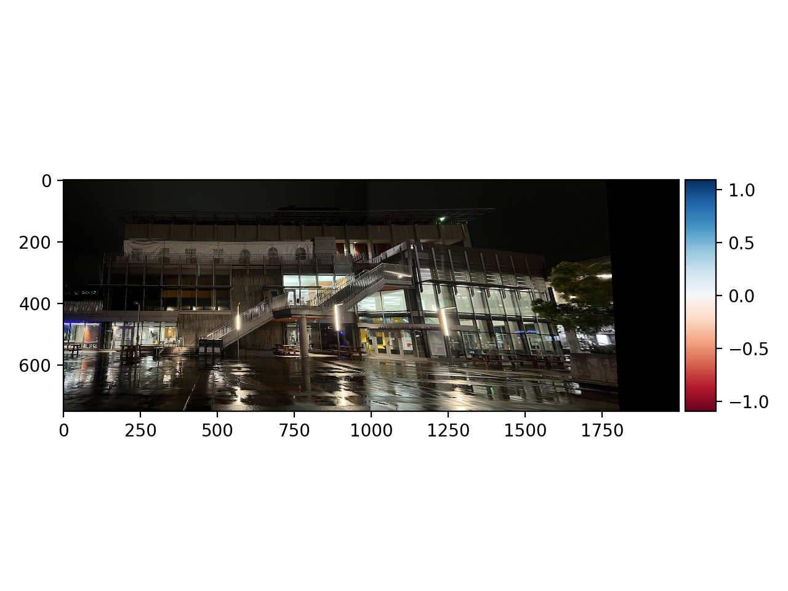
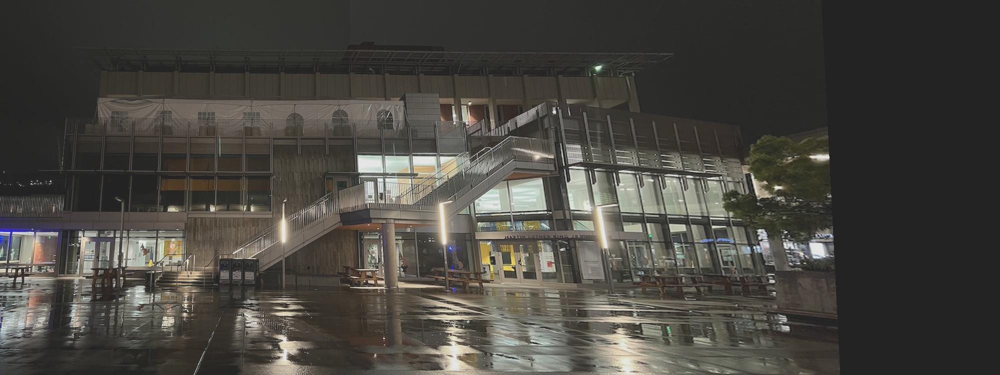

## Automatic Feature Matching and Image-stitching

### Introduction

When morphing images together, hand-picking point correspondences each time may be a time consuming job. Therefore, devising an automatic feature detecting and homography computing technique is vital for image stitching. In the parts below, we will go in details about the process of picking point correspondences, devising affine transformation matrix from matched features, and creating mosaic from several images. 

The parts below are inspired by [“*Multi-Image Matching using Multi-Scale Oriented Patches”*  by Brown et al](https://inst.eecs.berkeley.edu/~cs194-26/fa21/hw/proj4/Papers/MOPS.pdf).

### First Step of Feature Point Detection: Harris Corners

Since we are automatically generating feature correspondences, we must first retrieve points in the image that have sufficient "context". Such points usually apprear at "corners" of the image. There are multiple ways to identify a point as "corner", and we'll focus on one of the definitions in this project: Harris Corners. 

A point is defined as a Harris Corner if: given a window of pixels around the point, moving the window in all directions would result in a significant change of context. Expressed mathematically, Harris Corner occurs at $(x, y)$ if $E(u, v) =\displaystyle\sum_{(x, y) \in W}[I(x + u, y + v) - I(x, y)]^2$ is large for all $(u, v)$. 

To simplify the expression of $E(u, v)$, we will assume the sliding of window is small compared with window size, and use Taylor approximation: 
$$
\begin{aligned}
E(u, v) & =\displaystyle\sum_{(x, y) \in W}[I(x + u, y + v) - I(x, y)]^2 \\
& = \displaystyle \sum_{(x, y) \in W} [I(x, y) + I_xu + I_yv - I(x, y)]^2 \\
& = \displaystyle \sum_{(x, y) \in W} [I(x, y) + \begin{bmatrix}I_x & I_y\end{bmatrix} \begin{bmatrix}u \\ v\end{bmatrix} - I(x, y)]^2 \\
& = \displaystyle \sum_{(x, y) \in W} \left( \begin{bmatrix}I_x & I_y\end{bmatrix} \begin{bmatrix}u \\ v\end{bmatrix} \right)^2 \\
& = \displaystyle \sum_{(x, y) \in W} \begin{bmatrix}u & v\end{bmatrix} \begin{bmatrix} I_x^2 & I_xI_y \\ I_xI_y & I_y^2\end{bmatrix} \begin{bmatrix}u \\ v\end{bmatrix}
\end{aligned}
$$
Therefore, it suffices to know that a point $(x_0, y_0)$ can be considered as a Harris Corner if the eigenvalues $\lambda_1,\lambda_2$ of its "sum of derivative" matrix: $M = \displaystyle \sum_{(x, y) \in W} \begin{bmatrix} I_x^2 & I_xI_y \\ I_xI_y & I_y^2\end{bmatrix}$ are both large. In other words, we can define a corner strength function: $h(x_0, y_0) = \frac{\text{\textbf{det}}(M)}{\text{\textbf{tr}}(M)}$, whose value would be large if $(x_0, y_0)$ is a Harris Corner. 

During our actual implementation of coarse search of feature points, we first calculate $\begin{bmatrix} I_x^2 & I_xI_y \\ I_xI_y & I_y^2 \end{bmatrix}$ for each point location. We then impose Gaussian kernel with $\sigma = 1$ on the derivative matrix to calculate the "sum of derivative" matrix $M$ for each point location. The coarse feature points are selected by taking to local maxima in a $3 \times 3$ neighborhood. 

Below is a picture of the night Berkeley Bay from Lawrence Berkeley Lab, as well as coarse image features found on the image. 

**Original image:**

**Coarse feature points:**

### Second Step of Feature Point Detection: Non-max Suppression

As we may notice from the previous section, taking the local maxima within a $3 \times 3$ neighborhood is far from finding optimal feature points. In order to narrow down the population, we will try finding the corner points with top $n$ corner strength. 

Theoretically, we will initialize a disk with large radius $r$ that can cover the whole image. By applying the disk around each current feature point, we will keep the point as a "desired candidate" if every pixel within radius $r$ from that point has a smaller corner strength. For all the remaining feature points, we impose a smaller $r$ and pick another group of "desired candidates". The process is continued until we have picked enough feature points. 

In practice, we can use a robust algorithm to filter out the desired feature points. In particular, the maximum-suppression radius $r_i$ for each feature point $x_i$ is defined as: 

$$r_i = \underset{j}{\text{min}}|x_i - x_j|, \text{ x.t. } h(x_i) < c_{\text{robust}} h(x_j), \text{ }x_j \in F$$

where $x_i$ and $x_j$ are point locations of feature points, and $F$ represents the set of all current feature points. The hyperparameter $c_{\text{robust}}$ has a default value of 0.9. 

If no feature point is found in the image with corner strength greater than $\frac{1}{n}$ times of the corner strength of $x_i$, $x_i$ Is not suppressed, and its suppression radius is $\infty$. 

 $n$ desired feature points are then chosen by sorting all $r_i$ and picking the top $n$ points with highese suppression radius. 

Below is the location of top 500 candidate feature points in the night Berkeley Bay photo: 

**Non-max suppressed feature points:**

### Extracting Features

In order to match point correspondences between two images, only knowing locations of feature points is not enough. We also need to know the "context" of each feature point to match them together. In order to make context extraction less sensitive to exact feature location, we will force sampling to be at a lower frequency than where the feature point is located. In other words, we will consider a patch of pixels around the feature point that will together determine its context. 

According to the experiments conducted by Brown et al., we use an $8 \times 8$ patch around the feature point to determine its context. In practice, we will first sample a larger $40 \times 40$ patch, and downsample it to $8 \times 8$ to contain more information. Moreover, we normalize the values within the $8 \times 8$ patch to have mean 0 and standard deviation 1, in order to make features invariant to affine changes in pixel intensity. 

### Feature Matching

Next we will use the extracted feature context to match feature points between two images. A naive method is to iterate through all feature points in one image, and for each feature point, find out the feature point in the other image that has the closest context. However, the naive approach will force the algorithm to find a matching for each feature point, which is typically not the case when we create a mosaic from two images with different views (e.g.: feature points on the left half of the left view can never match with feature points in the right view, since the left half of the left view can never appear in the right view). 

In order to remedy potential over-matching, we have to find ways to filter out the points that can never be matched. To approach this problem, we can first think about the property of a pair of matching feature points: the difference of context around those two points should be significantly smaller than that of other candidate pairs. 

With this knowledge in hand, we can devise a more accurate method of detecting feature matchings. For every feature point in the first image, we calculate its context difference with every feature points in the second image. We then pick the smallest distance that corresponds to the best match. We also pick the second smallest distance to be the suboptimal match. Taking the ratio of these two distances ($\frac{d_{\text{optimal match}}}{d_{\text{suboptimal match}}}$), we can get the difference between the optimal match and the suboptimal match for a particular feature point. If the ratio is small, indicating that the optimal match is significantly better than the suboptimal one, we can then conclude that the optimal match is much likely to induce a matched feature point. On the other hand, if the ratio is big, indicating that the two matches differ slightly, then it is much likely that none of them results in the correct feature pair. 

According to experiments conducted by Brown et al., we use $\frac{d_{\text{optimal match}}}{d_{\text{suboptimal match}}} = 0.27$ as the default threshold, which works pretty well, as we will show in later sections. 

### RANSAC: Computing Homography

Although we have filtered out most outlier points with no matches, we still cannot guarantee that the remaining points all produce valid matchings that can be directly applied to calculating the affine transformation matrix. In other words, we have to further filter out outliers for accurate homography computation. Here we will apply a method called RANdom SAmple Consensus (or RANSAC). 

The workflow of RANSAC is to first assume that all feature pairs are valid. This would mean that randomly picking four of them would result in a good enough homography, which can map all feature points in one image to roughly their corresponding locations as the second image. If this is not the case, then some outliers must appear in either our chosen points or in the remaining points. 

To implement the RANSAC method, we will generate groups of $4$ feature pairs. We then calculate a affine transformation matrix using each group, and apply it to every feature point in the source image. Finally, we will pick the group of feature pairs that result in the most matches (inliers), and compute the final affine transformation matrix using all the inliers. 

### Putting Altogether: Automatic Image Stitching

The above sections have provided a detailed overview of how automatic feature detection and homography computation work. Putting all the techniques together, we can implement automatic image stitching. 

Below we show three groups of mosaics, computed both automatically and manually. We can see that the automatic approach achieves roughly the same effect as the manual approach. 

#### **Goup One: Night Berkeley Bay**

**Original left image:**

**Original right image:**

**Unmasked automatic result:**

**Masked automatic result:**

**Unmasked manual result:**

**Masked manual result:**

#### **Group Two: MLK**

**Original left image:**

**Original right image:**

**Unmasked automatic result:**

**Masked automatic result:**

**Unmasked manual result:**

**Masked manual result:**

#### **Group Three: Zellerbach Hall**

**Original left image:**

**Original right image:**

**Unmasked automatic result:**

**Masked automatic result:**

**Unmasked manual result:**

**Masked manual result:**

